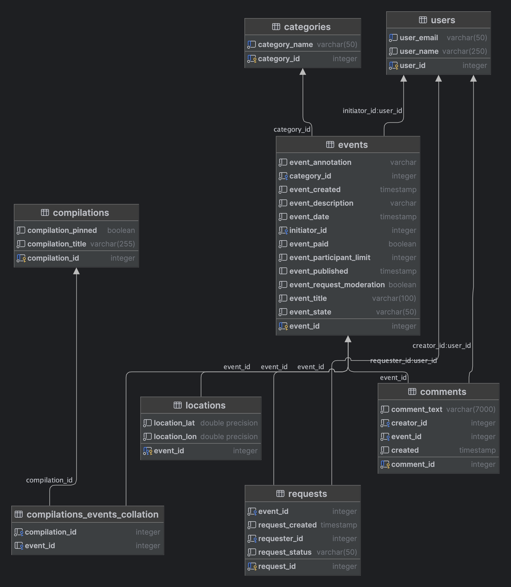

# Explore With Me

---

## Описание приложения

Приложение позволяет пользователям делиться информацией об интересных событиях и находить компанию для участия в них.

Это приложение - афиша. В нем можно предложить какое-либо событие от выставки до похода в кино и собрать компанию для
участия в нём.

---

## Функциональность и особенности

Приложение включает в себя два сервиса:

* **Основной сервис** (main-service) включает в себя основной функционал работы приложения
* **Cервис статистики** (stats-service) хранит количество просмотров и позволит делать различные выборки для анализа
  работы приложения.

### Возможности основного сервиса:

**Для публичного доступа:**

* поиск и просмотр событий по заданным фильтрам;
* просмотр подробной информации о конкретном событии;
* возможность получения всех имеющихся категорий и подборок событий.

**Для авторизованных пользователей:**

* побавление новых мероприятий, их редактирование и просмотр;
* подача заявок на участие в интересующих мероприятиях;
* Подтверждение или отклонение таких заявок для создателей мероприятия;
* добавление, редактирование и удаление собственных комментариев.

**Для администратора:**

* добавление, изменение и удаление категорий для событий;
* добавление, удаление и закрепление на главной странице подборки мероприятий;
* модерация событий, размещённых пользователями, — публикация или отклонение;
* управление пользователями — добавление, активация, просмотр и удаление;
* удаление комментариев пользователей.

### Возможности сервиса статистики:

Сервис статистики собирает информацию:

1) о количестве обращений пользователей к спискам событий;
2) о количестве запросов к подробной информации о событии.

По запросу он предоставляет статистику по выбранному эндпойнту за выбранные даты.

### Спецификация API

Спецификации лежат в корне проекта.

* cпецификация основного сервиса: ewm-main-service-spec.json
* cпецификация сервиса статистики: ewm-stats-service.json

Для работы с ними вам понадобится редактор Swagger.

---

## ER-диаграмма базы данных:



---

## Технологический стек

Проект использует следующий набор технологий, библиотек и инструментов:

- **[Spring Boot](https://spring.io/projects/spring-boot)**

- **[Docker](https://www.docker.com/)**

- **[Lombok](https://projectlombok.org/)**

- **[QueryDSL](http://www.querydsl.com/)**

- **[PostgreSQL](https://www.postgresql.org/)**

- **[Spring JPA](https://spring.io/projects/spring-data-jpa)**

- **[Hibernate](https://hibernate.org/)**

- **[IntelliJ IDEA](https://www.jetbrains.com/idea/)**

---

## Установка и запуск

Для того чтобы запустить проект у себя локально, необходимо выполнить следующие шаги:

### Предварительные требования

Убедитесь, что на вашем компьютере установлены следующие инструменты:

- Java JDK 11 или выше: [Скачать](https://www.oracle.com/java/technologies/javase-jdk11-downloads.html)
- Docker: [Инструкция по установке](https://docs.docker.com/get-docker/)
- IntelliJ IDEA (для разработки): [Скачать](https://www.jetbrains.com/idea/download/)

### Установка проекта

1. Клонируйте репозиторий проекта:

```
git clone https://https://github.com/DmitryMisevra/java-explore-with-me.git
cd java-explore-with-me
```

2. Запустите все сервисы одной командой с использованием Docker Compose:

```
docker-compose up --build
```

Эта команда сначала соберет образы для сервисов, указанных в файле docker-compose.yml, если они еще не собраны,
и затем запустит контейнеры. Флаг --build гарантирует, что будут использованы самые последние версии образов.

После успешного запуска контейнеров приложение будет доступно по следующим адресам:

* Основной сервис: http://localhost:8080
* Сервис статистики: http://localhost:9090

Базы данных доступны на портах 6541 и 6542 для stats-db и main-db соответственно, но обращение к ним обычно происходит
через приложения, работающие в контейнерах.

